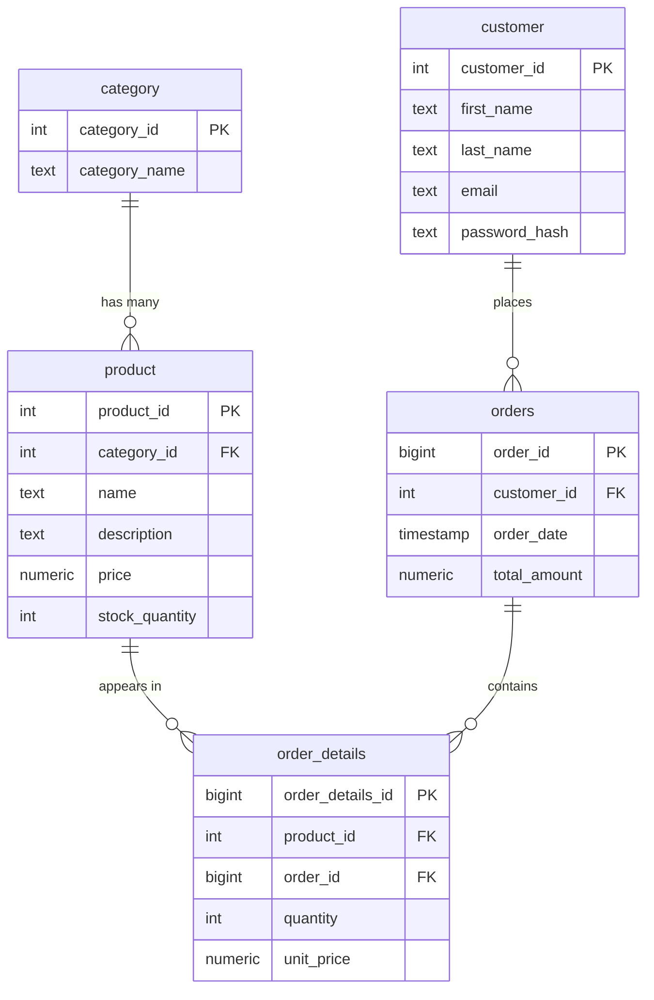

# Technical Design: SQL Arena

**Author**: Hisham (Tech Lead)
**Date**: 2026-06-09
**PRD**: `projects/sql-arena/prds/sql-arena.md`
**Decisions**: [AgDR-0001 (stack)](../docs/agdr/AgDR-0001-stack-selection.md) · [AgDR-0002 (timing)](../docs/agdr/AgDR-0002-execution-timing.md) · [AgDR-0003 (sequential execution)](../docs/agdr/AgDR-0003-sequential-execution.md) · [AgDR-0004 (optimization sandbox)](../docs/agdr/AgDR-0004-optimization-sandbox.md) · [AgDR-0005 (seeding via COPY)](../docs/agdr/AgDR-0005-seeding-via-copy.md)

**Stack**: NestJS (Node 20 / TypeScript) + Kysely + `pg` · PostgreSQL · static HTML/JS page · Docker Compose. Single Node process (no clustering) so the queue has one consumer.

## Overview

A single-host web tool for a SQL-optimization mentorship cohort. A user picks one of questions
Q5–Q9, types a display name, optionally writes **setup SQL to add indexes**, pastes a solution
`SELECT`, and submits. The server runs the setup + solution against the shared e-commerce dataset,
checks the result against a stored golden answer, measures the solution's execution time, and — if
correct — ranks the user on that question's leaderboard (best time per name). After each run the
worker **resets the seed DB to a pristine baseline**, so every contestant starts from the identical
index-free state and one person's indexes never leak into another's run (AgDR-0004). Adding an index
is the whole point of the exercise.

## Architecture

```
Browser (static index.html + fetch, polls for result)
        │  HTTP/JSON
        ▼
NestJS service (single Node process — Kysely/pg)
  GET  /                       → index.html
  GET  /api/questions          → [{code,title,prompt}]
  POST /api/submit             → enqueue into app.submissions, return {id, queued}   (non-blocking)
  GET  /api/submission/:id     → {status, position?, result?, exec_ms?}
  GET  /api/leaderboard/:code  → [{rank, name, exec_ms}]
        │
        │  + ONE background worker (Nest provider started on bootstrap):
        │      pop oldest queued submission → run setup+solution → time it → write result
        │      → RESET seed to baseline (if it ran setup) → next
        │      (single consumer ⇒ strictly one query at a time = fair timing)
        │ Kysely / pg
        ▼
PostgreSQL (one instance)
  ├─ schema seed   (role arena_runner: broad rights) ── worker runs setup (CREATE INDEX) + solution here
  │    category, product, customer, orders, order_details        ↳ reset to baseline after each run
  └─ schema app    (read/write via role arena_rw)
       questions(code, title, prompt, reference_query, ordered, golden_result)
       submissions(id, question_code, display_name, setup_sql, sql, status, result, exec_ms, ...)  ← queue
       leaderboard(question_code, display_name, exec_ms, updated_at)  UNIQUE(question_code, display_name)

baseline CSVs (on server, generated once via faker) ── COPY-loaded; reused for the post-run reset
```

Deploy: Docker Compose (`postgres` + `app`) on the existing VPS.

## Data Model

### seed schema (the dataset under study — from assignment Tasks 1–4)

The mentor-supplied e-commerce schema (canonical ERD: `/home/gomaa/Downloads/erd.png`), seeded via
faker-generated CSVs bulk-loaded with `COPY` (AgDR-0005). **Integer surrogate keys** (the reference
`ecommerce-system` repo uses UUID `BINARY(16)` — that's MySQL reference only; we use integer `*_id`).
**No indexes beyond primary keys initially** — the missing-index slowness is the entire point of the
exercise (mentees add indexes / rewrite queries to earn faster times).

> The original ERD names the orders table `order`, a SQL reserved word. We **rename it to `orders`**
> to avoid quoting it everywhere; otherwise the schema is exactly as supplied.



| Table | ~Rows | Columns |
|-------|-------|---------|
| `category` | ~100 | `category_id` (PK), `category_name` |
| `product` | ~100k | `product_id` (PK), `category_id` (FK), `name`, `description`, `price`, `stock_quantity` |
| `customer` | ~1M | `customer_id` (PK), `first_name`, `last_name`, `email`, `password_hash` |
| `orders` | (driven by data) | `order_id` (PK), `customer_id` (FK), `order_date`, `total_amount` |
| `order_details` | ~2–5M | `order_details_id` (PK), `product_id` (FK), `order_id` (FK), `quantity`, `unit_price` |

**This schema covers all of Q5–Q9:**

| Q | Question | Touches |
|---|----------|---------|
| Q5 | products per category | `product` grouped by `category_id` |
| Q6 | top customers by total spending | `customer` ⋈ `orders`, Σ(`orders.total_amount`) per customer |
| Q7 | 1000 most recent orders + customer info | `orders` ⋈ `customer`, order by `order_date` desc limit 1000 |
| Q8 | low-stock products (< 10) | `product` where `stock_quantity < 10` |
| Q9 | revenue per category | `order_details` ⋈ `product` ⋈ `category`, Σ(`quantity`×`unit_price`) per category |

> **Q6 "total spending" is defined as `Σ orders.total_amount` per customer** (mentor's call). Q9
> revenue must go through `order_details` because category isn't reachable from `orders`.
> `password_hash` exists in the schema but is unused by the tool.

### app schema (tool state)

| Table | Columns | Notes |
|-------|---------|-------|
| `questions` | `code` (Q5–Q9), `title`, `prompt`, `reference_query`, `ordered bool`, `golden_result jsonb` | `reference_query` + `golden_result` loaded from a **gitignored** file at setup — see "Golden results" below |
| `submissions` | `id`, `question_code`, `display_name`, `setup_sql`, `sql`, `status` (queued/running/done), `result` (correct/incorrect/error/timeout), `exec_ms`, `message`, `created_at`, `finished_at` | The async work **queue**; `setup_sql` is the optional index DDL; rows are transient and purged after the result is read |
| `leaderboard` | `question_code`, `display_name`, `exec_ms numeric`, `updated_at` | `UNIQUE(question_code, display_name)`; upsert keeps the **lower** `exec_ms` |

## Golden results & reference queries (kept secret)

The correct answer for each question must **never live in the repo** — a mentee could just read it.
So:

- The per-question reference query (the naive baseline that produces the correct result) lives in a
  **gitignored** file, e.g. `secrets/reference_queries.sql` (added to `.gitignore`; only ever on the
  server). The repo ships a `secrets/reference_queries.sql.example` with placeholders.
- At setup, a one-off loader runs each reference query against the seeded DB, normalises the result,
  and writes it to `questions.golden_result` (in the DB, not the repo). The DB volume is the only
  place the answer exists.
- The naive baseline doubles as the **time-to-beat**: optionally seed a `baseline` leaderboard entry
  from its measured time so contestants have a target.
- `/api/questions` returns only `code`, `title`, `prompt` — never `reference_query` or
  `golden_result`. The leaderboard exposes only `(name, exec_ms)`. Nothing leaks the answer.

The naive reference queries themselves are intentionally **not recorded in this committed design
doc** for the same reason — they're handed over out-of-band and dropped into the gitignored file.

## API Design

| Method | Path | Request | Response |
|--------|------|---------|----------|
| GET | `/api/questions` | — | `[{code, title, prompt}]` |
| POST | `/api/submit` | `{question_code, display_name, setup_sql?, sql}` | `{submission_id, status: queued}` — **returns immediately** |
| GET | `/api/submission/{id}` | — | `{status: queued\|running\|done, position?, result?: correct\|incorrect\|error\|timeout, exec_ms?, ranked?, message?}` |
| GET | `/api/leaderboard/{code}` | — | `[{rank, display_name, exec_ms}]` |

Submission is **asynchronous** (AgDR-0003): `/api/submit` enqueues and returns instantly; the client
polls `/api/submission/{id}` (~1s) until `status=done`, showing `queued (position N)` → `running` →
result. The request never blocks on the query run.

## Submission Runner (the core)

**Submissions are processed asynchronously by a single background worker — one at a time, never
concurrent** ([AgDR-0003]). `/api/submit` only enqueues; the worker does the running. Because there
is exactly one worker, runs are strictly sequential (the fairness invariant) with no lock and no
blocked request.

**Worker loop** (runs forever, started on app startup). The seed DB is pristine at the start of every
job (the previous job reset it):

```
loop:
  row = SELECT * FROM app.submissions WHERE status='queued'
        ORDER BY created_at FOR UPDATE SKIP LOCKED LIMIT 1
  if no row: sleep ~0.5s; continue
  mark row status='running'

  # --- run it via the arena_runner connection on the seed schema ---
  1. Solution guard: solution `sql` must be a single SELECT/WITH (reject otherwise) — keeps the
     ranked thing a query. setup_sql is optional and free-form (reset cleans up after it).
  2. If setup_sql: SET statement_timeout='120s'; execute it (e.g. CREATE INDEX / ANALYZE).
  3. SET statement_timeout='30s'.
     Correctness: execute solution → fetch rows → normalise (value-tuples; sort unless `ordered`)
     → compare to questions.golden_result. Mismatch → result=incorrect.
  4. If correct: EXPLAIN (ANALYZE, FORMAT JSON) solution ×3 → min "Execution Time" → exec_ms. [AgDR-0002]
  5. RESET: if setup_sql ran, restore seed to baseline — TRUNCATE + drop contestant indexes +
     re-COPY from the baseline CSVs (AgDR-0004 / AgDR-0005).
     (No setup ⇒ solution was read-only ⇒ skip reset.)

  write result back to row: status='done', result, exec_ms, message, finished_at
  if correct and exec_ms < current best for (code, name): upsert leaderboard (arena_rw)
```

`GET /api/submission/{id}` reads that row. `position` = count of `queued` rows created earlier. The
per-phase `statement_timeout` bounds each run; the reset between jobs keeps every contestant on the
identical index-free baseline.

Correctness rules (from PRD): **values only** (aliases ignored, extra columns ⇒ mismatch),
order-insensitive **except** `ordered` questions. Q5/Q8/Q9 → `ordered=false`; Q6 (top customers by
spend) and Q7 (most recent orders) → `ordered=true`.

## Safety Model

- **Seed integrity = reset after each run** (AgDR-0004), not least-privilege. A submission may add
  indexes / mutate `seed`; the worker drops+reloads it from the baseline before the next job, so the
  shared DB is always pristine at job start.
- `arena_runner` has rights on `seed` only; `app` (questions/queue/leaderboard) is on `arena_rw` and
  is **unreachable from submission SQL** — no contestant can read the golden answers or edit the board.
- **Solution must be a single `SELECT`/`WITH`** (guarded) so the ranked artefact stays a query;
  `setup_sql` is free-form but its effects are wiped by the reset.
- `statement_timeout` (120s setup / 30s solution) bounds runaways.
- No auth by design (PRD non-goal) — trusted cohort.
- Single background worker draining a queue → runs are serialized by construction, so timings are
  fair and a runaway query can't pile up parallel load. The request itself never executes user SQL
  (it only enqueues), so the web tier stays responsive.
- Residual (accepted for a trusted cohort): a contestant could precompute the answer in free-form
  `setup_sql`; optional setup whitelist (`CREATE INDEX`/`ANALYZE`) is the lever if it matters.

## Implementation Plan

Mostly linear (a weekend tool). Safe-vocabulary steps — **none of these are tracker tickets yet**:

| Step | Work | Depends on |
|------|------|------------|
| Step 1 | Repo scaffold: NestJS skeleton + Kysely/`pg`, Docker Compose (postgres + app), static `index.html`, README, `.gitignore` (incl. CSVs + secrets) | — |
| Step 2 | DB bootstrap: schema DDL (integer-keyed tables, PK-only), `seed`+`app` schemas, `arena_runner`/`arena_rw` roles + grants | Step 1 |
| Step 3 | Seed: faker **CSV generator** (port the `ecommerce-system` faker logic) + **`COPY` loader** run-on-server (AgDR-0005); CSVs double as the reset baseline. Validate locally at small volume first | Step 2 |
| Step 4 | Question registry: load Q5–Q9 prompts; load naive reference queries from the **gitignored** `secrets/reference_queries.sql`; run them to compute & store golden results in the DB | Step 3 |
| Step 5 | Async runner: `submissions` queue table + single background-worker loop + solution SELECT guard + optional setup-SQL phase + correctness compare + EXPLAIN-ANALYZE timing (best-of-3) + **post-run seed reset** from baseline | Step 4 |
| Step 6 | Endpoints: `/api/submit` (enqueue, incl. `setup_sql`), `/api/submission/{id}` (poll), `/api/leaderboard/{code}`, `/api/questions`; leaderboard upsert (best-per-name) | Step 5 |
| Step 7 | Static page: question picker, name field, **setup-SQL textarea (optional, "add indexes — not timed")**, solution textarea; submit → poll status (queued/position → running → result) → render leaderboard | Step 6 |
| Step 8 | Deploy to VPS + smoke test the full submit→rank loop incl. an index-optimized run | Step 7 |

Rough size: small–medium. Steps 3 + 5 carry the most risk (seed volume; runner + reset); the rest is plumbing.

## Risks & Mitigations

| Risk | Mitigation |
|------|------------|
| Seeding ~6M rows too slow (batched INSERT) | Generate CSVs + bulk-load with `COPY` (AgDR-0005); generate on the server, no large upload |
| Timing noise makes ranking feel arbitrary | EXPLAIN ANALYZE min-of-3; document that it's a learning tool, not a benchmark |
| A user submits a query that's correct by luck on small data | Volumes large enough that wrong queries usually differ in result; correctness is exact-match |
| Warm-cache advantage for repeat runs | Accepted as negligible; min-of-3 damps it |
| A submission corrupts/mutates the seed | Full reset to baseline after each run (AgDR-0004) — next contestant always starts pristine |
| Seed reset is too slow → queue crawls | v1 re-COPYs from the baseline CSVs (fast); skip reset when no setup ran; deferred levers: template DB (`CREATE DATABASE ... TEMPLATE`) or txn-rollback isolation |
| Contestant precomputes the answer in `setup_sql` | Accepted for a trusted cohort; optional setup whitelist (`CREATE INDEX`/`ANALYZE`) is the lever |
| Concurrent submissions skewing each other's timing | Async queue + single worker (AgDR-0003) — one run at a time, by construction |
| Submission burst | Requests return instantly; jobs queue; client polls and sees `position N`. 30s per-run timeout keeps the line moving |
| Worker process dies | Queue stalls until restart; jobs persist in `app.submissions` and resume — no data loss |
| Reserved-word table name | Table renamed `order` → `orders` so no quoting is needed anywhere |
| Golden answer leaks via the repo | Reference queries + golden results are gitignored / DB-only; API never returns them |

## Open Questions

| Question | Owner | Status |
|----------|-------|--------|
| Stack | Mentor | **Resolved** — NestJS (Node/TS) + Kysely + `pg` (AgDR-0001) |
| Integer keys vs. reference UUIDs | Tech Lead → Mentor confirm | Using integer `*_id` per canonical ERD; reference repo's UUIDs are MySQL-only |
| Exact reference (naive baseline) query for each of Q5–Q9 | Tech Lead drafts → Mentor confirms | Tech Lead drafted naive baselines (in chat); to be placed in gitignored file, not committed |
| Q6 "total spending" definition | Mentor | **Resolved** — `Σ orders.total_amount` per customer |
| Isolation = drop+reseed after each run | Mentor | **Resolved** — accepted; revisit speed (template DB / rollback) later if slow |
| Min-of-3 enough, or want best-of-5? | Tech Lead | Defaulting to 3 |
